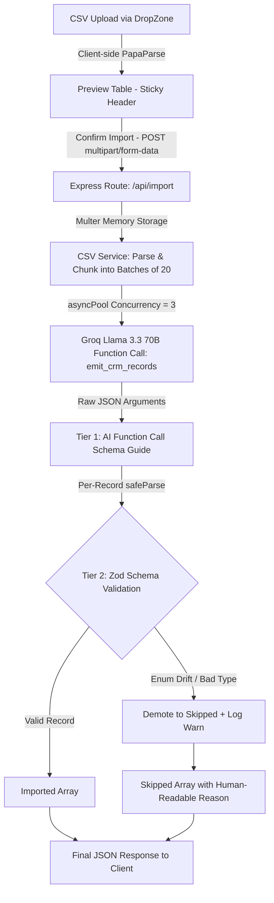

# GrowEasy AI-Powered CRM CSV Importer

An intelligent, stateless, AI-powered CSV importer built for **GrowEasy** CRM. It maps messy, inconsistent real estate lead exports (Facebook Lead Ads, Google Ads, manual spreadsheets, sales CRM exports) to the structured GrowEasy CRM schema using **Groq (`llama-3.3-70b-versatile`)** and structured OpenAI-compatible function calling, backed by strict **Zod runtime validation**.

---

## 1. Problem Understanding

Importing leads into a CRM from arbitrary CSV files is traditionally brittle due to:
1. **Wildly Inconsistent Headers**: Column names vary drastically across sources (`"Phone"`, `"Cell"`, `"Mob No"`, `"Contact No"`, etc.).
2. **Strict Schema Constraints**: Certain CRM fields require exact enum values (`crm_status`, `data_source`) or strict date formats (`created_at`).
3. **Complex Multi-Value Rules**: Leads may contain multiple email addresses or phone numbers along with combined country code prefixes (`+91-9876543210`).
4. **Resilience & Batch Integrity**: Individual malformed records shouldn't fail an entire batch of thousands of leads.

### Our Solution
- **Semantic Mapping via LLM Function Calling**: Maps CSV fields by *semantic meaning* rather than rigid column header matching.
- **Unified Overflow Accumulation**: Automatically preserves secondary emails, secondary phone numbers, and unstructured remarks by piping them into `crm_note`.
- **Country Code Splitting**: Deterministically splits `"+CC-NNNNNNNNNN"` into `country_code` and `mobile_without_country_code`.
- **Two-Tier Validation**: Uses prompt & function schema definitions as a guide, and **per-record Zod `safeParse`** as the authoritative safety gate.

---

## 2. Architecture & Data Flow

The project is structured as a monorepo containing:
- `apps/api`: **Express + TypeScript** backend handling file uploads, CSV chunking, bounded concurrency AI extraction, and Zod validation.
- `apps/web`: **Next.js 14 (App Router) + Tailwind CSS** frontend featuring a responsive 4-step wizard with theme toggle, preview table, and card-based skipped results view.



---

## 3. Why Zod Validation is the Real Enum Safety Net

> [!IMPORTANT]
> **LLM function calling schemas are a prompt-level guide, NOT a server-side hard rejection.**

When using Groq (`llama-3.3-70b-versatile`) or Anthropic with structured function calling, JSON Schema `enum` constraints strongly bias the model toward choosing valid values (`GOOD_LEAD_FOLLOW_UP`, `DID_NOT_CONNECT`, `BAD_LEAD`, `SALE_DONE`). However, large language models can still occasionally hallucinate or return out-of-spec strings (e.g., `"Hot Lead"` or `"Follow Up"`).

To guarantee strict database/CRM integrity:
1. **Never use `.parse()` on the full tool response**: A single bad record would throw an exception and destroy the entire batch of 20 leads.
2. **Per-Record `safeParse`**: Each extracted record is validated independently against `CrmRecordSchema`.
3. **Graceful Demotion**: If an enum drifts or fails Zod validation, only that specific record is moved to `skipped` with the exact validation failure reason (`"failed post-validation: crm_status: Invalid enum value"`), while the remaining valid records in the batch are successfully imported.

---

## 4. Setup & Local Development

### Prerequisites
- **Node.js** v18+
- **npm** v9+
- A valid **Groq API Key** (`GROQ_API_KEY`)

### Installation

1. **Clone the repository and install dependencies**:
   ```bash
   # Install API dependencies
   cd apps/api
   npm install

   # Install Web dependencies
   cd ../web
   npm install
   ```

2. **Configure Environment Variables**:

   Create `apps/api/.env`:
   ```env
   PORT=4000
   GROQ_API_KEY=your_groq_api_key_here
   BATCH_SIZE=20
   MAX_RETRIES=3
   MAX_CONCURRENT_BATCHES=3
   CORS_ORIGIN=http://localhost:3000
   ```

   Create `apps/web/.env.local`:
   ```env
   NEXT_PUBLIC_API_URL=http://localhost:4000
   ```

3. **Start Development Servers**:

   Start the backend Express API (runs on `http://localhost:4000`):
   ```bash
   cd apps/api
   npm run dev
   ```

   Start the frontend Next.js App (runs on `http://localhost:3000`):
   ```bash
   cd apps/web
   npm run dev
   ```

### Production Deployment with Docker Compose

To start both the Express API and Next.js frontend in containerized production mode:

1. **Set your Groq API key in your environment**:
   ```bash
   # Linux / macOS / Git Bash
   export GROQ_API_KEY="your_groq_api_key_here"

   # Windows PowerShell
   $env:GROQ_API_KEY="your_groq_api_key_here"
   ```

2. **Build and start the containers**:
   ```bash
   docker compose up --build -d
   ```
   - **Frontend App**: `http://localhost:3000`
   - **Express API**: `http://localhost:4000`

---

## 5. Environment Variables Reference

### `apps/api/.env`
| Variable | Default | Description |
|---|---|---|
| `PORT` | `4000` | Port for the Express API server |
| `GROQ_API_KEY` | *(Required)* | Groq API Key for Llama 3.3 70B extraction |
| `BATCH_SIZE` | `20` | Number of CSV rows per AI function call batch |
| `MAX_RETRIES` | `3` | Exponential backoff retry attempts per batch |
| `MAX_CONCURRENT_BATCHES` | `3` | Parallel batch concurrency ceiling (`asyncPool`) |
| `CORS_ORIGIN` | `http://localhost:3000` | Allowed frontend origin |

### `apps/web/.env.local`
| Variable | Default | Description |
|---|---|---|
| `NEXT_PUBLIC_API_URL` | `http://localhost:4000` | Base URL of the local Express API |
